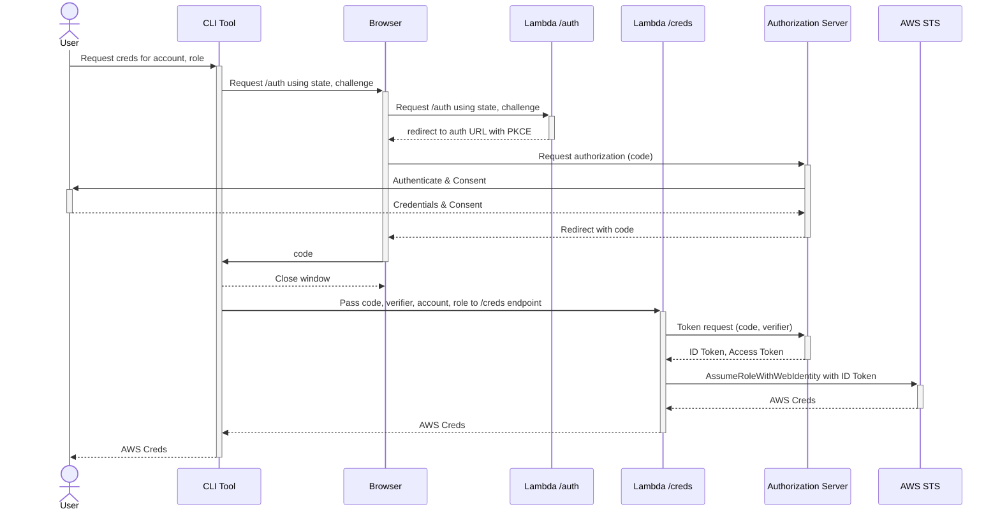

# Architecture

## Sequence of Operations

```mermaid
sequenceDiagram
    actor User as User
    participant CLI as CLI Tool
    participant Browser as Browser
    participant Lauth as Lambda /auth
    participant Lcreds as Lambda /creds
    participant AuthZ as Authorization Server
    participant sts as AWS STS

    # auth
    User ->>+ CLI: Request creds for account, role
    CLI ->>+ Browser: Request /auth using state, challenge
    Browser ->>+ Lauth: Request /auth using state, challenge
    Lauth -->>- Browser: redirect to auth URL with PKCE
    Browser ->>+ AuthZ: Request authorization (code)
    AuthZ ->>+ User: Authenticate & Consent
    User -->>- AuthZ: Credentials & Consent
    AuthZ -->>- Browser: Redirect with code
    Browser ->>- CLI: code
    CLI -->> Browser: Close window

    # creds
    CLI ->>+ Lcreds: Pass code, verifier, account, role to /creds endpoint
    Lcreds ->>+ AuthZ: Token request (code, verifier)
    AuthZ -->>- Lcreds: ID Token, Access Token
    Lcreds ->>+ sts: AssumeRoleWithWebIdentity with ID Token
    sts -->>- Lcreds: AWS Creds
    Lcreds -->>- CLI: AWS Creds
    CLI -->>- User: AWS Creds
```
